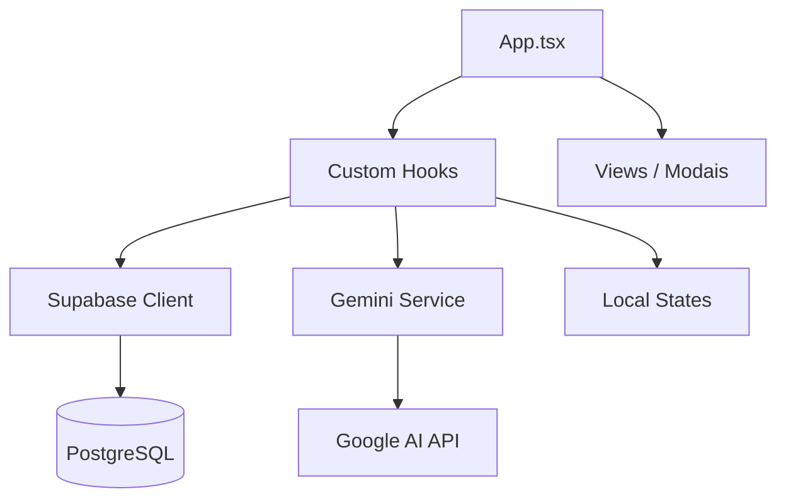

# Product Requirements Document

> Gerado automaticamente em: 23/01/2026
> Base de análise: Local workspace (v1.1 - Pós-integração Supabase)

---

## 1. 📋 Visão Geral

**Projeto:** Major Hub  
**Descrição:** Plataforma premium de gestão criativa e marketing, permitindo o gerenciamento de clientes, projetos, entregas dinâmicas e colaboração interna com suporte a IA.  
**Versão atual:** 1.0.0 (Integração Supabase Concluída)

### Stack Tecnológico

| Categoria | Tecnologia | Versão |
|-----------|------------|--------|
| **Frontend** | React | ^19.2.3 |
| **Linguagem** | TypeScript | ~5.8.2 |
| **Build Tool** | Vite | ^6.2.0 |
| **CSS** | Tailwind CSS (Play CDN) | v3+ |
| **Backend/Auth** | Supabase | ^2.45.0 |
| **AI** | Google GenAI (Gemini) | ^1.37.0 |
| **Runtime** | Node.js | - |

---

## 2. 🏗️ Arquitetura

### Padrão Arquitetural
**SPA Monolítica com Hooks de Serviço** - Aplicação React que utiliza hooks customizados (`useAuth`, `useProjects`, `useClients`) para mediar a comunicação entre a UI e o backend Supabase.

### Estrutura de Diretórios

```
/major-hub
├── App.tsx              # Orquestrador principal da UI e navegação
├── index.tsx            # Ponto de entrada React
├── index.html           # Template HTML com configurações de Tailwind e Fontes
├── types.ts             # Tipos de domínio e mapeadores de dados
├── constants.tsx        # Dados de UI (estáticos) e placeholders
├── /components          # Componentes de UI (Views e Modais)
│   ├── LoginView.tsx
│   ├── Sidebar.tsx
│   ├── ProjectCard.tsx
│   ├── ... (16 componentes)
├── /hooks               # Lógica de negócio e estado persistente
│   ├── useAuth.ts       # Autenticação e Perfis via Supabase
│   ├── useProjects.ts   # CRUD de Projetos via Supabase
│   ├── useClients.ts    # Gestão de Clientes via Supabase
├── /services            # Clientes de API
│   ├── supabase.ts      # Cliente Supabase singleton
│   ├── gemini.ts        # Integração com Google Gemini
└── /types               # Tipos gerados
    └── database.ts      # Definições de esquema do Supabase
```

### Fluxo de Dados



---

## 3. 💻 Padrões de Implementação

### Convenções de Nomenclatura

| Tipo | Padrão | Exemplo |
|------|--------|---------|
| **Arquivos de Componente** | PascalCase | `ProjectDetailsModal.tsx` |
| **Interfaces/Types** | PascalCase | `User`, `Project` |
| **Hooks** | camelCase (prefixo use) | `useAuth` |
| **Funções/Variáveis** | camelCase | `handleLogin` |
| **Constantes** | UPPER_SNAKE | `INITIAL_INSPIRATION` |

### Exemplo de Estrutura de Componente

```typescript
import React from 'react';
import { Project } from '../types';

interface ProjectCardProps {
  project: Project;
  onClick: () => void;
}

export const ProjectCard: React.FC<ProjectCardProps> = ({ project, onClick }) => {
  return (
    <div className="bg-white dark:bg-slate-900 p-6 rounded-3xl" onClick={onClick}>
      {/* Tailwind classes para estilização */}
    </div>
  );
};
```

---

## 4. 🎨 UI e Estilização

### Framework CSS e Design
**Tailwind CSS (CDN)** configurado no `index.html`. A estética é focada em **Rich Aesthetics**, com cantos arredondados generosos (`2rem`), sombras suaves e transições fluidas.

**Tokens de Design:**
- **Primário:** `#8b5cf6` (Vibrant Violet)
- **Background:** `#fafafb` (Light) / `#0f172a` (Dark)
- **Acentos:** Peach, Mint, Lavender (para categorização de entregas)
- **Fontes:** Plus Jakarta Sans (Display), Outfit (Body)

### Responsividade
- Sidebar colapsável dinamicamente.
- Layouts de grade adaptáveis (1 a 3 colunas).
- Breakpoints padrão do Tailwind (`sm`, `md`, `lg`, `xl`).

---

## 5. 🔄 Gerenciamento de Estado e Dados

### Persistência Real (Supabase)
O estado global de dados foi migrado de mocks para o Supabase:
- **Autenticação:** Gerenciada pelo `useAuth`. Suporta sessões persistentes e perfis vinculados ao ID do `auth.users`.
- **Relacionamentos:** Multi-tenant baseado em `client_id`. Usuários `MANAGER` veem todos os clientes, enquanto usuários `CLIENT` veem apenas seu contexto.

---

## 6. 🚀 Infraestrutura e Deploy

### Ambientes
- **Local:** `npm run dev` (Vite, porta 3000)
- **Deploy:** Configuração para Vercel/Netlify sugerida (não finalizada pipelines oficiais).

### Variáveis de Ambiente (.env.local)
- `VITE_SUPABASE_URL`
- `VITE_SUPABASE_ANON_KEY`
- `GEMINI_API_KEY`

---

## 7. 🔌 Dependências e Integrações

### Core
- `react`, `react-dom` (v19)
- `@supabase/supabase-js` (v2)
- `@google/genai` (v1)

### Integrações
1. **Supabase:** Base de dados relacional e Autenticação.
2. **Google Gemini:** Geração de inspirações e insights criativos.
3. **Material Symbols:** Iconografia dinâmica via Google Fonts.

---

## 8. ✅ Qualidade e Testes

### Estado Atual
- **Linter/Formatter:** Não configurado formalmente no repositório.
- **Testes:** Frameworks como Vitest sugeridos, mas não implementados.
- **TypeScript:** Utilizado rigorosamente em toda a base de código, com tipos gerados para o banco de dados.

---

## 9. 🔒 Segurança

### Implementado
- **RLS (Row Level Security):** Todas as tabelas no Supabase possuem políticas que garantem isolamento de dados entre clientes.
- **Auth:** Uso de JWT via Supabase Auth.
- **Níveis de Acesso:** `MANAGER` vs `CLIENT` controlados via coluna `access_level` na tabela `users`.

---

## 10. 🎯 Próximos Passos e Roadmap

### Débitos Técnicos
- [ ] Implementar sistema de chat real (atualmente mockado em `MensagensView`).
- [ ] Configurar upload de arquivos no Supabase Storage (atualmente links externos).
- [ ] Adicionar Error Boundaries para falhas de API.

### Melhorias de UI/UX
- [ ] Implementar Skeleton Loaders para estados de carregamento do Supabase.
- [ ] Adicionar notificações em tempo real (Realtime) para atualizações de projetos.

---

## 11. 📝 Glossário
- **Project:** Unidade principal de trabalho ligada a um cliente.
- **Creative Goal:** Sub-objetivos ou entregáveis de um projeto (Design, Vídeo, etc).
- **Inspiration:** Imagens/insights gerados por IA para o projeto.

---

**Última atualização:** 23/01/2026  
**Analisado por:** Codebase Analysis Skill  
**Revisão:** Concluída (Status: Backend Integrado)
